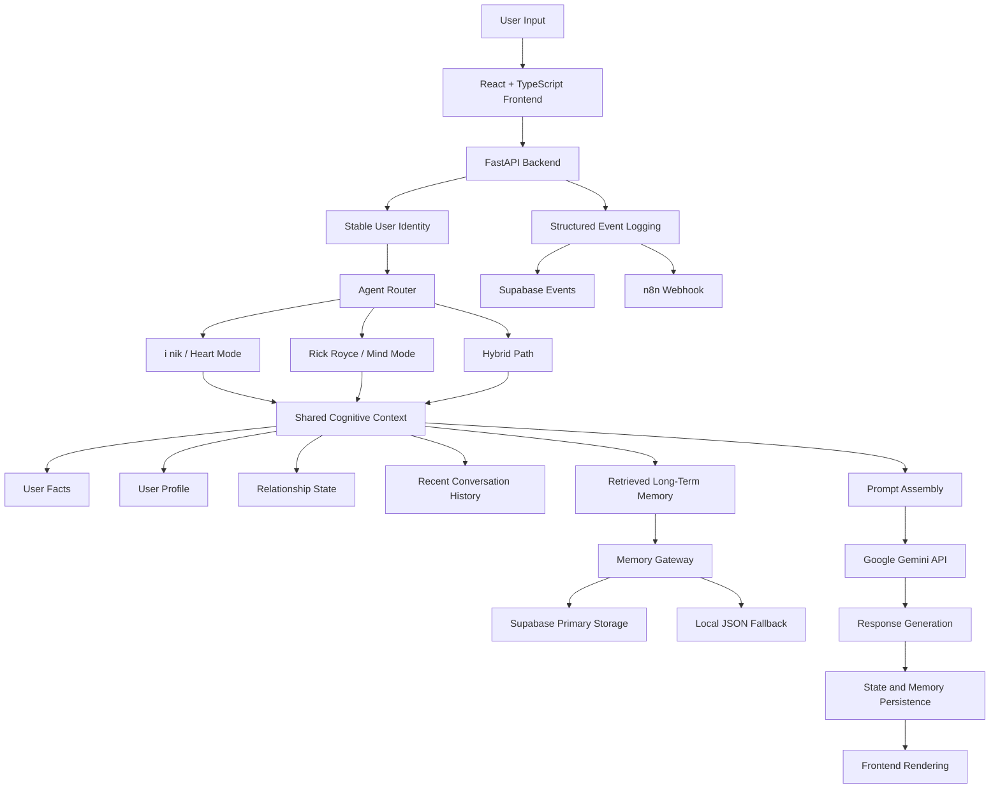
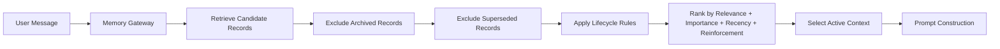

# i nik

## Memory-Driven AI Platform with Agent Routing

i nik is a full-stack conversational AI platform designed around persistent memory, user identity, relationship progression, behavioral continuity, and specialized response routing.

The platform uses two response modes that share the same cognitive context:

* **i nik — Heart Mode:** memory, familiarity, emotional context, and relationship continuity
* **Rick Royce — Mind Mode:** strategic reasoning, trade-off analysis, risk assessment, and decision support

This is not an autonomous multi-agent orchestration system. The modes do not independently delegate tasks, communicate through planner–executor loops, or run autonomous tool-use cycles. A routing layer selects the most appropriate response mode, and each path receives the same shared memory, profile, relationship state, and user identity.

---

## Project Delivery

**Timeline:** 9 June 2026 – 24 June 2026
**Delivery Duration:** 16 days
**Role:** Applied AI Developer / Full-Stack AI Product Builder

**Scope:**

* Product and behavioral system design
* React and TypeScript frontend
* FastAPI backend and REST APIs
* Persistent memory architecture
* Agent-style response routing
* Supabase integration and local fallback
* Regression testing
* Production deployment
* Technical documentation

---

## Live System

**Frontend:**
https://inik-cafe.vercel.app

**Backend API:**
https://inik-agent.onrender.com

**Backend Repository:**
https://github.com/Ioonooni/inik-agent

**Frontend Repository:**
https://github.com/Ioonooni/inik-cafe

> Google Gemini free-tier requests may temporarily return HTTP 429 when external request limits are reached. This is a model-provider quota limitation rather than a failure of the platform’s routing, memory, persistence, or API architecture.

---

## Product Goal

Most conversational AI systems are stateless or depend primarily on recent chat history.

i nik explores a different product model:

> Can an AI system create stronger long-term continuity by combining persistent memory, relationship state, user profiles, behavioral rules, and specialized reasoning modes?

The platform is designed to preserve relevant user context across conversations while allowing different response modes to interpret that context differently.

Potential applications include:

* AI companions
* AI tutors
* Strategic advisors
* Language-learning partners
* Character-based AI products
* Long-term conversational interfaces

---

## Core Capabilities

### Persistent Memory

The memory system supports:

* Conversation memory
* Structured user facts
* User profile signals
* Relationship-state context
* Query-matched retrieval
* Time-ordered recent retrieval
* Supabase-backed storage
* Local JSON fallback
* Runtime memory loading

The goal is not to retain every message. The system attempts to preserve information according to relevance, quality, recurrence, and long-term value.

### Memory Intelligence

The advanced memory layer includes:

* Importance scoring by memory category
* Quality gating before persistence
* Hit-count reinforcement for recurring information
* Time-based decay by memory type
* Conflict detection across supported fact categories
* Soft superseding instead of destructive deletion
* Retrieval ranking using importance, relevance, recency, and reinforcement
* Lifecycle filtering for archived and superseded records
* Backward compatibility for legacy memory records

Examples of supported conflict categories include:

* Name
* Preference
* Dislike
* Study
* Project
* Location
* Possession

When two memories conflict, the losing record can be marked as superseded rather than permanently removed. This preserves history while reducing its ranking weight in future retrieval.

### Shared Cognitive Context

Both response modes receive the same core context:

* Stable user identity
* User facts
* User profile
* Relationship state
* Recent conversation history
* Retrieved long-term memories

The behavioral mode changes, but the underlying user context remains shared.

This separation allows the system to support distinct conversational behaviors without duplicating memory and profile infrastructure.

### Agent Routing

The routing layer selects among:

* i nik / Heart response path
* Rick Royce / Mind response path
* Hybrid response path

Routing is based on the user message and interaction context.

Typical Heart-mode requests involve:

* Personal continuity
* Emotional context
* Memory callbacks
* Relationship-aware conversation

Typical Mind-mode requests involve:

* Strategic decisions
* Trade-off analysis
* Risk evaluation
* Opportunity cost
* Career or project planning

The router does not create autonomous delegation loops. It selects a specialized response path before prompt construction.

### Structured Fact Recall

Known facts can be answered through a structured recall path rather than requiring every response to depend on generative inference.

Examples include:

* User name
* Favorite color
* Interests
* Pet name
* Other supported profile facts

This reduces unnecessary model dependence for deterministic memory queries.

### Relationship State

The system tracks:

* Trust
* Familiarity
* Curiosity
* Attachment
* Relationship score
* Relationship stage

Relationship variables influence interaction context and behavioral continuity.

Current stages include:

* Observer
* Gremlin
* Treasure

The relationship system is rule-guided and should not be interpreted as a psychological model or a claim of genuine emotional understanding.

### Adaptive Behavioral State

The user profile can store adaptive behavioral signals such as:

* Warmth
* Playfulness
* Curiosity
* Directness
* Formality
* Initiative
* Memory callback tendency
* Conversation style
* Recurring topics
* Topic affinity

These values guide response construction while preserving the character’s core behavioral constraints.

### Event Logging and Workflow Integration

The platform includes infrastructure for structured events such as:

* User messages
* Reward events
* Redemption events
* Relationship changes
* Memory-related events

Events can be stored in Supabase and sent to n8n through webhook-based workflows.

This creates a foundation for future:

* Product analytics
* CRM workflows
* Loyalty systems
* Notifications
* Reward fulfillment
* Behavioral reporting

---

## System Architecture



---

## Memory Retrieval Flow



Legacy records without newer lifecycle metadata remain eligible for retrieval to preserve backward compatibility.

---

## Key Architecture Decisions

### 1. Separate Behavior from Shared Cognition

The response modes use different behavioral instructions but receive the same user state.

This avoids duplicating:

* Memory storage
* Profile logic
* Relationship tracking
* User identity
* Retrieval infrastructure

### 2. Use Routing Instead of Autonomous Agent Orchestration

The platform currently uses bounded mode selection rather than autonomous multi-agent collaboration.

This decision reduces:

* Model-call cost
* Latency
* Delegation ambiguity
* Loop risk
* Debugging complexity

A larger coordinator–planner–reviewer architecture may be explored only when a task clearly benefits from multiple independent reasoning stages.

### 3. Keep Deterministic Recall Separate from Generative Responses

Structured facts can be recalled directly when available.

This improves reliability for known information and allows some memory operations to continue even when Gemini quota is unavailable.

### 4. Preserve Conflicting History

Conflicting memories are soft-superseded rather than deleted.

This provides:

* Historical traceability
* Safer rollback
* Lower risk of destructive overwrite
* Better control over ranking behavior

### 5. Use Supabase with Local Fallback

Supabase is the primary persistence layer, while a local fallback supports resilience during database or configuration failures.

This is a prototype reliability decision, not a replacement for a complete production disaster-recovery strategy.

### 6. Filter Memory at Runtime

Memory intelligence is integrated into runtime retrieval rather than existing only as isolated utilities or tests.

Archived, superseded, and low-value lifecycle candidates can be excluded before prompt construction.

---

## Example API Usage

### Health Check

```bash
curl https://inik-agent.onrender.com/health
```

Expected response:

```json
{
  "ok": true,
  "service": "i nik agent api",
  "gemini_configured": true
}
```

### Send a Chat Message

```bash
curl -X POST https://inik-agent.onrender.com/api/chat \
  -H "Content-Type: application/json" \
  -d '{
    "user_id": "demo_user",
    "message": "ช่วยวิเคราะห์ข้อดีข้อเสียของทางเลือกนี้",
    "agent_mode": "auto"
  }'
```

### Retrieve User State

```bash
curl "https://inik-agent.onrender.com/api/state?user_id=demo_user"
```

The returned state may include:

* Relationship variables
* User profile
* User facts
* Recent messages
* Active response mode
* Runtime metadata

---

## Local Development

The frontend and backend are maintained in separate repositories.

### Backend

```bash
git clone https://github.com/Ioonooni/inik-agent.git
cd inik-agent

python -m venv .venv
source .venv/bin/activate

pip install -r requirements.txt
cp .env.example .env

uvicorn inik_api:app --reload
```

On Windows PowerShell:

```powershell
python -m venv .venv
.venv\Scripts\Activate.ps1

pip install -r requirements.txt
copy .env.example .env

uvicorn inik_api:app --reload
```

Backend development URL:

```text
http://localhost:8000
```

### Frontend

```bash
git clone https://github.com/Ioonooni/inik-cafe.git
cd inik-cafe

npm install
npm run dev
```

Optional frontend environment variable:

```env
VITE_API_BASE_URL=http://localhost:8000
```

Production fallback API:

```text
https://inik-agent.onrender.com
```

---

## Environment Configuration

Create a local `.env` file from `.env.example`.

Typical backend configuration includes:

```env
GEMINI_API_KEY=your_key_here
SUPABASE_URL=your_supabase_url
SUPABASE_KEY=your_supabase_key
```

Do not commit live API keys or production secrets.

---

## Testing and Validation

The project was validated through:

* Unit checks
* Integration checks
* End-to-end flow tests
* Runtime persistence tests
* Memory retrieval tests
* Fact extraction tests
* Routing tests
* Production API checks
* Frontend production builds
* CORS verification
* Deployment verification

### Verified V3 Results

* **109 regression checks passed**
* **0 regression failures**
* FastAPI production health endpoint verified
* React/Vite production build completed successfully
* Frontend bundle verified against the deployed API
* Supabase-backed fact persistence verified
* Direct fact recall verified
* Agent routing path verified
* Shared cognitive context verified
* Memory lifecycle filtering integrated into runtime retrieval
* Backend and frontend repositories synchronized with clean working trees

The test count indicates that the implemented checks passed. It should not be interpreted as a quantitative measure of retrieval precision, conversational quality, or model accuracy.

---

## Example Regression Fixed

A production verification test revealed that the Thai sentence:

```text
สีโปรดของฉันคือสีม่วง
```

was incorrectly matched by a broad name-extraction pattern, causing the system to store:

```json
{
  "name": "สีม่วง"
}
```

The extraction logic was corrected so the system stores:

```json
{
  "favorite_color": "สีม่วง"
}
```

without overwriting the user’s name.

This regression was reproduced locally, covered by a targeted test, validated against the broader response pipeline, deployed, and verified again in production.

---

## Engineering Review Process

At the end of V1, I conducted a staged, context-limited technical review to reduce self-confirmation bias.

Instead of presenting the project as my own work, I evaluated it from the perspective of a company reviewing an internship candidate. Project context was introduced gradually so the architecture and engineering decisions could be assessed before personal context influenced the review.

The process identified issues including:

* Technical debt
* Incomplete runtime integration
* Weak persistence paths
* Deployment risk
* Overstated architecture terminology
* Insufficient production verification

The findings were converted into remediation tasks and verified against:

* Source code
* Runtime behavior
* Regression tests
* Production APIs
* Deployment output
* Repository state

The AI-generated review was treated as an adversarial checklist, not as ground truth.

This process directly influenced later work including:

* Memory lifecycle runtime integration
* Fact-recall regression fixes
* Production deployment verification
* Frontend/backend synchronization
* Repository cleanup
* More precise architecture terminology

---

## Delivery Milestones

### V1 — Behavioral Platform Foundation

Delivered:

* Character framework
* Persistent memory
* Relationship engine
* Response modes
* Reward system
* Redemption workflow
* Event logging
* Supabase integration
* Runtime persistence
* User profiling

### V2 — Memory Intelligence and Shared Context

Delivered:

* Memory quality scoring
* Memory reinforcement
* Time-based decay
* Conflict detection
* Soft superseding
* Ranking improvements
* Memory Gateway V2
* Supabase primary storage
* Local fallback
* Shared user context
* Agent routing foundation

### V3 — Production Runtime Integration

Delivered:

* Memory lifecycle filtering in live RAG retrieval
* Archived and superseded memory exclusion
* Legacy memory compatibility
* Shared cognitive context across Heart, Mind, and hybrid paths
* Production routing between response modes
* Thai structured-fact extraction validation
* Favorite-color regression remediation
* 109 passing regression checks
* Render backend deployment verification
* Vercel frontend deployment verification
* CORS and API connectivity verification
* Clean and synchronized repositories
* Updated technical documentation

---

## Current Limitations

The project is a deployed applied-AI platform and engineering prototype. It is not presented as an enterprise-ready SaaS product.

Current limitations include:

* Gemini free-tier quota and request limits
* Rule-guided relationship and behavioral state
* No autonomous inter-agent communication
* No planner–executor delegation loop
* No independent tool-use agents
* Authentication exists as a foundation rather than a complete production user flow
* No formal retrieval precision benchmark
* No measured hallucination rate
* No published latency or cost benchmark
* No production-scale load testing
* Local fallback is not a complete disaster-recovery system

---

## Evaluation Work Still Needed

Future evaluation should measure:

* Retrieval precision
* Retrieval hit rate
* False-memory rate
* Conflict-resolution accuracy
* Fact-extraction accuracy
* Response-routing accuracy
* Memory persistence reliability
* End-to-end latency
* Token consumption
* Cost per conversation
* Behavioral consistency across long contexts

These metrics are not currently claimed.

---

## Possible Next Steps

Potential future work includes:

* Complete production authentication flow
* Row Level Security policies
* Formal retrieval-quality dataset
* Automated behavioral evaluation
* Deployment monitoring
* Model-provider fallback
* Semantic or embedding-based retrieval
* Bounded coordinator–planner–reviewer workflow for strategic tasks
* Tool execution only where task value justifies additional complexity
* Analytics dashboard for behavioral and product metrics

A future multi-agent implementation would require explicit:

* Agent state
* Delegation policy
* Message passing
* Tool permissions
* Stopping conditions
* Retry limits
* Loop protection
* Cost controls
* Observability
* Comparative evaluation against the current routed architecture

---

## Technical Stack

### Frontend

* React
* TypeScript
* Vite

### Backend

* Python
* FastAPI
* REST APIs

### AI

* Google Gemini API
* Behavioral prompt construction
* Shared cognitive context
* Agent-style response routing

### Data and Memory

* Supabase
* PostgreSQL foundation
* JSON fallback
* Structured user facts
* RAG-based retrieval

### Automation

* n8n
* Structured event payloads
* Webhook integration

### Deployment

* Render
* Vercel
* GitHub
* GitHub Codespaces

---

## Repository Structure

Important backend components include:

```text
inik_api.py                FastAPI runtime and API routes
facts.py                   Structured fact extraction and recall
memory_gateway_v2.py       Supabase and local memory gateway
memory_lifecycle.py        Archive and lifecycle rules
memory_ranking.py          Memory ranking logic
rag_memory.py              Retrieval paths
rag_prompt.py              Safe shared-context construction
relationship.py            Relationship-state logic
event_logger.py            Event and webhook integration
```

The exact repository structure may evolve as the system is refactored.

---

## What This Project Demonstrates

i nik demonstrates practical experience in:

* Applied AI product development
* Conversational AI architecture
* Persistent memory systems
* RAG integration
* Structured fact extraction
* Behavioral system design
* Agent-style routing
* Shared cognitive context
* FastAPI backend development
* React and TypeScript frontend development
* Supabase persistence
* Workflow automation
* Regression testing
* Production debugging
* Deployment verification
* Technical debt remediation
* Engineering documentation

The project focuses on application architecture, product integration, behavioral systems, and runtime reliability rather than model training or machine-learning research.

---

## License and Usage

This repository is primarily an applied AI engineering portfolio project.

Review the repository license and configuration before reusing code, deployment settings, character definitions, or production credentials.
